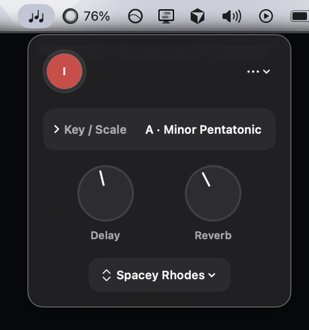

# Clack

Activate Clack and it generates ambient sound while you type.

Now you can make music while you work.

## Preview

[Watch video demo (MP4)](public/Built-in%20Retina%20Display.mp4)

## How it works

- Clack lives in your macOS menu bar.
- Turn it on with the switch (or `Option + Command + T`).
- Start typing in any app.
- Your typing becomes soft musical notes in real time.

## Customize your sound

- Choose key and scale
- Change instrument
- Adjust delay and reverb
- Shift octave range

## Permissions

Clack needs:

- Accessibility
- Input Monitoring

These are required so Clack can react to your key presses across apps.

## Privacy

- No keystrokes are stored
- Everything runs locally on your Mac
- Clack pauses in secure input fields (like password entry)
